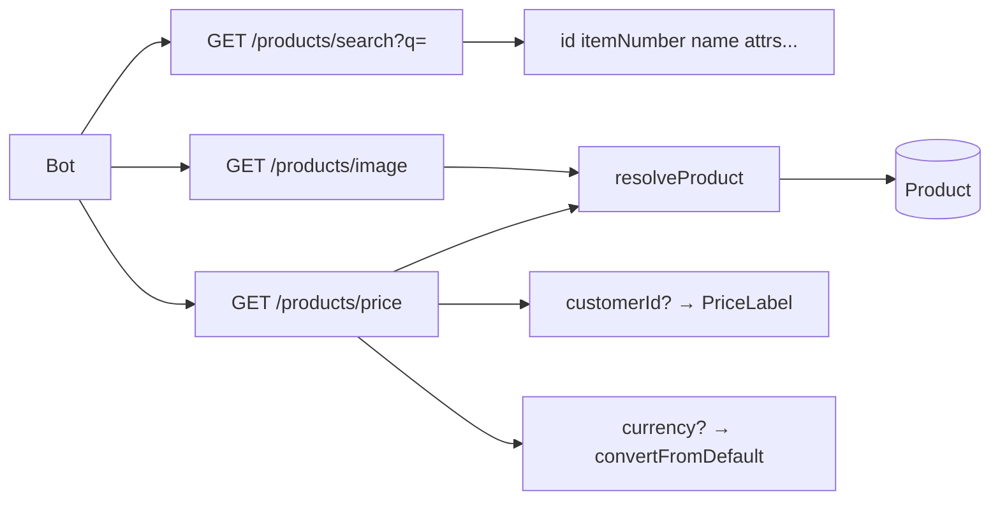

# تقسيم Bot Products API

## القرارات المعتمدة

- حذف [`GET /api/v1/bot/products/search`](app/api/v1/bot/products/search/route.ts) الثقيل (SQL/FTS/filters/أسعار).
- حذف [`POST /api/v1/bot/check-price`](app/api/v1/bot/check-price/route.ts).
- ثلاثة مسارات جديدة تحت `/api/v1/bot/products/`.
- تعريف المنتج في السعر والصورة: `productId` **أو** `itemNumber` (واحد منهما إلزامي).
- السعر: `customerId` اختياري؛ `currency` (رمز العملة مثل `SAR`) اختياري لفرض العملة المطلوبة.
- الصور: الصورة الرئيسية فقط.



## العقد الجديد

### 1) بحث — `GET /api/v1/bot/products/search`

| Param | مطلوب | معنى |
|-------|--------|------|
| `q` | نعم | اسم أو رقم منتج |
| `page` / `limit` | لا | افتراضي 20، حد 50 |

**الاستجابة `data`:** مصفوفة خفيفة فقط:

- `id`, `itemNumber`, `name`, `isAvailable`
- `brand` (`{ id, name }` أو `null`)
- `category` (`{ id, name }`)
- `attributes[]` (`code`, `name`, `value`)

بدون أسعار وبدون صور.

**منطق البحث (Prisma، بدون FTS ميّت):**

1. تطابق تام على `itemNumber` أولاً (إن وُجد) يُرجع في المقدمة.
2. وإلا: `OR` على `name ILIKE`, `itemNumber ILIKE`, و`alternativeNames` إن أمكن بسهولة عبر Prisma.
3. فلتر افتراضي اختياري لاحقًا غير مطلوب الآن — لا `available`/`category` في هذه الجولة (أقل سطح API).

### 2) سعر — `GET /api/v1/bot/products/price`

| Param | مطلوب | معنى |
|-------|--------|------|
| `productId` أو `itemNumber` | أحدهما | تعريف المنتج |
| `customerId` | لا | تسمية التسعير + عملات العميل إن لم تُمرَّر عملة |
| `currency` | لا | رمز عملة هدف (مثل `USD`) |

**قواعد التسعير** (نفس روح `check-price` عبر [`convertFromDefault`](lib/currency-utils.ts)):

1. جلب `ProductPrice` للمنتج.
2. فلترة `PriceLabel`: من عميل إن وُجد `priceLabelId`، وإلا التسمية الافتراضية (`isDefault`).
3. العملات المستهدفة:
   - إن وُجد `currency` → تلك العملة فقط (404 إن رمز غير معروف).
   - وإلا إن وُجد `customerId` وله `CustomerCurrency` → تلك العملات.
   - وإلا → العملة الافتراضية.
4. `customerId` غير موجود → 404 `NOT_FOUND` (فقط عندما يُمرَّر).

**شكل مختصر للاستجابة:**

```json
{
  "productId": "...",
  "itemNumber": "...",
  "productName": "...",
  "customerId": null,
  "prices": [
    {
      "label": "...",
      "value": 12.5,
      "unit": "...",
      "currency": { "code": "SAR", "symbol": "...", "name": "..." }
    }
  ]
}
```

### 3) صورة رئيسية — `GET /api/v1/bot/products/image`

| Param | مطلوب |
|-------|--------|
| `productId` أو `itemNumber` | أحدهما |

**الاستجابة:** صورة واحدة (`isPrimary` ثم `order`) أو 404 إن لا صورة:

```json
{ "productId": "...", "itemNumber": "...", "url": "...", "alt": null }
```

## هيكل الملفات

| ملف | دور |
|-----|-----|
| [`lib/bot/resolve-product.ts`](lib/bot/resolve-product.ts) **جديد** | `resolveProductRef({ productId?, itemNumber? })` → منتج أو `BotServiceError` |
| [`lib/bot/product-search.ts`](lib/bot/product-search.ts) | إعادة كتابة بحث Prisma خفيف + Zod |
| [`lib/bot/product-price.ts`](lib/bot/product-price.ts) **جديد** | منطق السعر (يستبدل جزءًا من check-price) |
| [`lib/bot/product-image.ts`](lib/bot/product-image.ts) **جديد** | جلب الصورة الرئيسية |
| [`lib/bot/index.ts`](lib/bot/index.ts) | تصدير الدوال الجديدة؛ إزالة `checkPrice` |
| [`app/api/v1/bot/products/search/route.ts`](app/api/v1/bot/products/search/route.ts) | route رفيع + Zod |
| [`app/api/v1/bot/products/price/route.ts`](app/api/v1/bot/products/price/route.ts) **جديد** | |
| [`app/api/v1/bot/products/image/route.ts`](app/api/v1/bot/products/image/route.ts) **جديد** | |
| [`app/api/v1/bot/check-price/`](app/api/v1/bot/check-price/) | **حذف** (`route.ts` + استيراداتها) |
| [`lib/bot/check-price.ts`](lib/bot/check-price.ts) | **حذف** |

نمط كل route:

```typescript
validateApiKey → parse query Zod → service → apiSuccess / handleBotServiceError
```

## توثيق وعقد

- تحديث [`public/openapi.json`](public/openapi.json): مسارات الثلاثة الجديدة؛ حذف `check-price` والوصف القديم لـ search.
- تحديث [`.cursor/skills/nawaat-bot-api/SKILL.md`](.cursor/skills/nawaat-bot-api/SKILL.md) و [`.cursor/skills/nawaat-pricing/SKILL.md`](.cursor/skills/nawaat-pricing/SKILL.md).
- تصحيح الإشارات في [`docs/api-reference.md`](docs/api-reference.md) / [`AGENTS.md`](AGENTS.md) إن وُجدت لـ check-price أو البحث الثقيل.

## خارج النطاق (متعمد)

- لا إصلاح `search_vector` / FTS في هذه الجولة — البحث الجديد Prisma.
- لا دمج مع Meilisearch.
- لا تغيير Dashboard/Server Actions.
- لا إبقاء aliases الكثيرة القديمة (`color`/`suffix`/…) في البحث الجديد.
