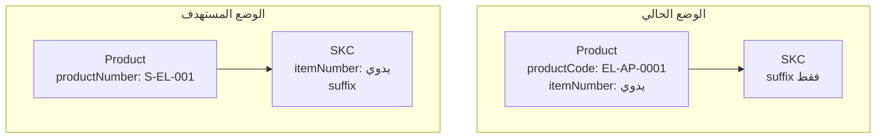

# الخطة النهائية — إعادة ضبط الأكواد ورقم المنتج

> **الحالة:** جاهزة للتنفيذ  
> **النطاق:** Schema، Server Actions، UI، Meilisearch، Bot API، Migration

---

## 1. الهدف

إعادة هيكلة نظام الأكواد في Nawaat CRM وفق نموذج SPU/SKC/SKU:

| التغيير | التفاصيل |
|---------|----------|
| كود البراند | حرف أو رقم **واحد** `[A-Z0-9]` |
| كود التصنيف | **خانتان** `[A-Z0-9]` (موجود في الواجهة) |
| رقم المنتج | حقل جديد `Product.productNumber` — يُولَّد تلقائياً |
| إلغاء الرقم المركب | حذف `Product.productCode` |
| نقل رقم الصنف | من `Product.itemNumber` إلى `SKC.itemNumber` |

---

## 2. صيغة رقم المنتج (النهائية)

```
{BRAND}-{CATEGORY}-{SEQUENCE}
  1 خانة    2 خانات     3 خانات
    S         EL          001
```

**مثال كامل:** `S-EL-001`

| المقطع | المصدر | الطول | Fallback |
|--------|--------|-------|----------|
| البرند | `Brand.code` | 1 | `X` |
| التصنيف | `Category.code` | 2 | `GE` |
| التسلسل | عداد تلقائي | 3 (`001`–`999`) | — |

- **الترتيب:** برند → تصنيف → تسلسل (البرند في البداية)
- **الفاصل:** `-`
- **نطاق العداد:** لكل تركيبة **برند + تصنيف** (مفتاح `ProductNumberSequence`)
- **regex:** `^[A-Z0-9]{1}-[A-Z0-9]{2}-[0-9]{3}$`

### صيغة SKU (بدون تغيير في المنطق)

```
{productNumber}-{skcSuffix}[-{sizeSuffix}]
```

مثال: `S-EL-001-STD` أو `S-EL-001-RED-M`

---

## 3. مقارنة: قبل وبعد



| | القديم | الجديد |
|---|--------|--------|
| مثال المنتج | `EL-AP-0001` | `S-EL-001` |
| ترتيب المقاطع | تصنيف - برند - تسلسل(4) | **برند - تصنيف - تسلسل(3)** |
| كود البراند | حرفان | **حرف/رقم واحد** |
| كود التصنيف | خانتان | خانتان |
| رقم الصنف اليدوي | على `Product` | على **`SKC`** |
| مجلد الصور | `productCode` | `productNumber` |

---

## 4. تغييرات Schema (Prisma)

ملف: [`prisma/schema.prisma`](../prisma/schema.prisma)

### Product

```prisma
model Product {
  productNumber  String  @unique  // "S-EL-001"
  // حذف: productCode, itemNumber
}
```

### SKC

```prisma
model SKC {
  itemNumber  String?  @unique  // رقم الصنف اليدوي (باركود)
}
```

### Brand

```prisma
model Brand {
  code  String  @unique  // 1 char e.g. "S"
}
```

### Category

```prisma
model Category {
  code  String  @unique  // 2 chars e.g. "EL" — بدون تغيير في الطول
}
```

### ProductNumberSequence (إعادة تسمية من ProductCodeSequence)

```prisma
model ProductNumberSequence {
  categoryCode  String
  brandCode     String
  lastSequence  Int      @default(0)
  @@unique([categoryCode, brandCode])
}
```

---

## 5. Migration SQL

ملف مقترح: `prisma/migrations/YYYYMMDD_product_number_refactor/migration.sql`

### الخطوات

1. **إضافة أعمدة جديدة**
   - `Product.productNumber` (nullable مؤقتاً)
   - `SKC.itemNumber` (nullable)

2. **اختصار أكواد البراند** (2 → 1)
   - أخذ الحرف الأول: `SM` → `S`
   - حل التعارضات: ترقيم رقمي (`2`, `3`…) أو تعديل يدوي

3. **اختصار أكواد التصنيف** (إن وُجدت 3 خانات)
   - `ELC` → `EL` مع حل تعارضات

4. **بناء `productNumber`** لكل منتج من `productCode` القديم:
   - `EL-AP-0001` → استخراج: تصنيف=`EL`, برند=`A`, تسلسل=`001`
   - النتيجة: **`A-EL-001`**

5. **نقل `itemNumber`**
   - من `Product.itemNumber` → `SKC.itemNumber` للـ SKC الافتراضي (`isDefault = true`)

6. **إعادة بناء `SKU.skuCode`**
   - `{productNumber}-{suffix}[-{size}]`

7. **ترحيل `ProductCodeSequence` → `ProductNumberSequence`**
   - تحديث `brandCode` للحرف الواحد
   - ضبط `lastSequence` للحد 999

8. **حذف الأعمدة القديمة**
   - `Product.productCode`, `Product.itemNumber`
   - جدول `ProductCodeSequence`

9. **مزامنة Meilisearch** كاملة بعد الترحيل

---

## 6. الإعدادات والتوليد

### ملف جديد: [`lib/config/product-number.config.ts`](../lib/config/product-number.config.ts)

```typescript
export const PRODUCT_NUMBER_CONFIG = {
  separator: '-',
  brand:    { length: 1, fallbackCode: 'X', pattern: /^[A-Z0-9]{1}$/ },
  category: { length: 2, fallbackCode: 'GE', pattern: /^[A-Z0-9]{2}$/ },
  sequence: { length: 3, padChar: '0' },
  // regex + maxPerCombo (999)
}
```

### دالة التوليد: [`lib/actions/inventory/_shared.ts`](../lib/actions/inventory/_shared.ts)

```typescript
generateProductNumber(categoryCode, brandCode, tx) → "S-EL-001"
// ترتيب الإرجاع: `${brCode}-${catCode}-${seqStr}`
```

- **حذف:** `generateProductCode`
- **إبقاء مؤقت:** `export const PRODUCT_CODE_CONFIG = PRODUCT_NUMBER_CONFIG` للتوافق أثناء الترحيل

---

## 7. Server Actions

### [`lib/actions/brands.ts`](../lib/actions/brands.ts)
- تحقق server-side: `/^[A-Z0-9]{1}$/`
- `toUpperCase()` عند الحفظ

### [`lib/actions/categories.ts`](../lib/actions/categories.ts)
- تحقق server-side: `/^[A-Z0-9]{2}$/` (مواءمة مع الواجهة)

### [`lib/actions/inventory/product.actions.ts`](../lib/actions/inventory/product.actions.ts)
| الدالة | التغيير |
|--------|---------|
| `createProduct` | توليد `productNumber`؛ لا `itemNumber` |
| `updateProduct` | منع تعديل `productNumber`؛ إزالة `itemNumber` |
| `duplicateProduct` | `productNumber` جديد + نسخ `itemNumber` على SKC |
| `deleteProduct` | مجلد الصور بـ `productNumber` |

### [`lib/actions/skc.ts`](../lib/actions/skc.ts)
| الدالة | التغيير |
|--------|---------|
| `addSKC` | دعم `itemNumber` اختياري |
| `updateSKC` | تعديل `itemNumber` |
| `getSKCsPaginated` | بحث بـ `itemNumber` و `productNumber` |
| `createDefaultSkcForProduct` | يستقبل `productNumber` بدل `productCode` |
| `buildSkuCode` | يستخدم `productNumber` |

### [`lib/actions/import.ts`](../lib/actions/import.ts)
- `itemNumber` في CSV → يُحفظ على SKC الافتراضي
- `productNumber` يُولَّد تلقائياً
- `brandCode`: خانة واحدة؛ `categoryCode`: خانتان
- معاينة: `S-EL-***`
- التحقق من تكرار `itemNumber` على جدول `SKC`

### [`lib/actions/upload.ts`](../lib/actions/upload.ts)
- مجلدات الصور: `productNumber` بدل `productCode`

### [`lib/actions/sku.ts`](../lib/actions/sku.ts)
- `buildSkuCode(productNumber, ...)`

---

## 8. Types و Includes

| الملف | التغيير |
|-------|---------|
| [`lib/types/product.ts`](../lib/types/product.ts) | `productNumber`؛ إزالة `itemNumber` من `ProductInput` |
| [`lib/types/skc.ts`](../lib/types/skc.ts) | `itemNumber` في `SkcInput` و `SerializedSKC*` |
| [`lib/types/brand.ts`](../lib/types/brand.ts) | تعليق الكود: حرف واحد |
| [`lib/prisma-includes.ts`](../lib/prisma-includes.ts) | تحديث select fields |
| [`lib/actions/inventory/_shared.ts`](../lib/actions/inventory/_shared.ts) | `serializeProduct`: `productNumber` بدل `productCode` |

---

## 9. واجهة المستخدم

| الملف | التغيير |
|-------|---------|
| [`components/brands/brand-form.tsx`](../components/brands/brand-form.tsx) | `length(1)`, `maxLength={1}`, regex `[A-Za-z0-9]` |
| [`components/categories/category-form.tsx`](../components/categories/category-form.tsx) | مراجعة `length(2)` (موجود) |
| [`components/inventory/product-form.tsx`](../components/inventory/product-form.tsx) | عرض `productNumber` للقراءة؛ حذف حقل `itemNumber` |
| [`app/(dashboard)/products/columns.tsx`](../app/(dashboard)/products/columns.tsx) | عمود "رقم المنتج"؛ حذف "الرقم المركب" و"رقم الصنف" |
| [`app/(dashboard)/inventory/columns.tsx`](../app/(dashboard)/inventory/columns.tsx) | نفس التعديل |
| [`components/items/skc-columns.tsx`](../components/items/skc-columns.tsx) | عمود `itemNumber`؛ `productNumber` بدل `productCode` |
| [`components/items/skc-sheet.tsx`](../components/items/skc-sheet.tsx) | حقل `itemNumber` عند الإنشاء |
| [`components/items/skc-details-client.tsx`](../components/items/skc-details-client.tsx) | عرض/تعديل `itemNumber` |
| [`components/inventory/import/*`](../components/inventory/import/) | توضيح: `itemNumber` → SKC؛ `categoryCode` خانتان؛ `brandCode` خانة |

---

## 10. التكاملات الخارجية

| النظام | الملف | التغيير |
|--------|-------|---------|
| Meilisearch | [`lib/utils/meilisearch-sync.ts`](../lib/utils/meilisearch-sync.ts) | `productNumber` + تجميع `itemNumbers` من SKCs |
| Meilisearch index | [`lib/meilisearch.ts`](../lib/meilisearch.ts) | `searchableAttributes`: `productNumber` |
| Bot API | [`app/api/v1/bot/products/search/route.ts`](../app/api/v1/bot/products/search/route.ts) | بحث بـ `productNumber` و `skc.itemNumber` |
| الإعلانات | [`lib/utils/message-builder.ts`](../lib/utils/message-builder.ts) | `{{product.productNumber}}` + `{{skc.itemNumber}}` |
| المعرض | [`lib/actions/gallery.ts`](../lib/actions/gallery.ts) | `productNumber` |
| Seed | [`prisma/seed.ts`](../prisma/seed.ts) | مثال: `X-GE-001` |
| OpenAPI | [`public/openapi.json`](../public/openapi.json) | تحديث الحقول والأوصاف |
| Skill | [`.cursor/skills/nawaat-inventory/SKILL.md`](../.cursor/skills/nawaat-inventory/SKILL.md) | توثيق الصيغة `BR-CAT-SEQ` |

---

## 11. الملفات المتأثرة (~35 ملف)

```
prisma/schema.prisma
prisma/migrations/YYYYMMDD_product_number_refactor/migration.sql
prisma/seed.ts

lib/config/product-number.config.ts          (جديد)
lib/config/product-code.config.ts            (re-export أو حذف)
lib/actions/inventory/_shared.ts
lib/actions/inventory/product.actions.ts
lib/actions/inventory/product.queries.ts
lib/actions/inventory/new-tags.queries.ts
lib/actions/brands.ts
lib/actions/categories.ts
lib/actions/skc.ts
lib/actions/sku.ts
lib/actions/import.ts
lib/actions/upload.ts
lib/actions/gallery.ts
lib/actions/product-images.ts
lib/types/product.ts
lib/types/skc.ts
lib/types/brand.ts
lib/prisma-includes.ts
lib/utils/meilisearch-sync.ts
lib/meilisearch.ts
lib/utils/message-builder.ts

components/brands/brand-form.tsx
components/inventory/product-form.tsx
components/items/skc-*.tsx
components/inventory/import/*
app/(dashboard)/products/columns.tsx
app/(dashboard)/inventory/columns.tsx
app/(dashboard)/inventory/new-tags/new-tags-table.tsx
app/(dashboard)/inventory/search-engine/search-engine-client.tsx
app/(dashboard)/gallery/gallery-client.tsx
app/api/v1/bot/products/search/route.ts
public/openapi.json
.cursor/skills/nawaat-inventory/SKILL.md
```

---

## 12. ترتيب التنفيذ

```
1. Schema + migration SQL
2. npm run db:migrate && npm run db:generate
3. product-number.config.ts + generateProductNumber
4. _shared.ts (serialize) + types + prisma-includes
5. brands.ts + categories.ts (validation)
6. product.actions.ts + skc.ts + sku.ts + import.ts
7. upload.ts + gallery + product-images
8. UI: brands → products → items → import
9. meilisearch-sync + meilisearch.ts + bot API
10. message-builder + seed + openapi + skill
11. npm run lint && npm run build
12. مزامنة Meilisearch كاملة
```

---

## 13. خطة الاختبار

- [ ] إنشاء براند بكود حرف واحد (`S`)
- [ ] إنشاء تصنيف بكود خانتين (`EL`)
- [ ] إنشاء منتج → يظهر `S-EL-001`
- [ ] إنشاء منتج ثانٍ بنفس البرند والتصنيف → `S-EL-002`
- [ ] إضافة SKC مع `itemNumber` يدوي
- [ ] استيراد CSV مع `itemNumber` على الصنف
- [ ] بحث Meilisearch بـ `productNumber` و `itemNumber`
- [ ] Bot API search يعيد النتائج الصحيحة
- [ ] نسخ منتج → `productNumber` جديد
- [ ] رفع صورة → المجلد باسم `productNumber`
- [ ] طلب قديم يعرض `skuCode` snapshot بدون تأثر

---

## 14. المخاطر والقيود

| الخطر | التخفيف |
|-------|---------|
| تعارض أكواد البرند عند الاختصار | migration script مع حل تعارضات |
| تجاوز 999 منتج/برند+تصنيف | رسالة خطأ واضحة؛ توسيع لاحقاً إن لزم |
| مجلدات صور قديمة | rename في migration أو script منفصل |
| Bot API breaking change | تحديث OpenAPI + إبلاغ المستهلكين |
| OrderItem snapshots | لا تتأثر — `skuCode` محفوظ |

---

## 15. ملخص القرارات النهائية

1. **كود البراند:** حرف/رقم واحد
2. **كود التصنيف:** خانتان
3. **رقم المنتج:** `{BRAND}-{CATEGORY}-{SEQ3}` — البرند في البداية
4. **رقم الصنف:** على SKC وليس Product
5. **الرقم المركب القديم:** يُحذف بالكامل
6. **العداد:** 3 خانات (001–999) لكل برند+تصنيف
