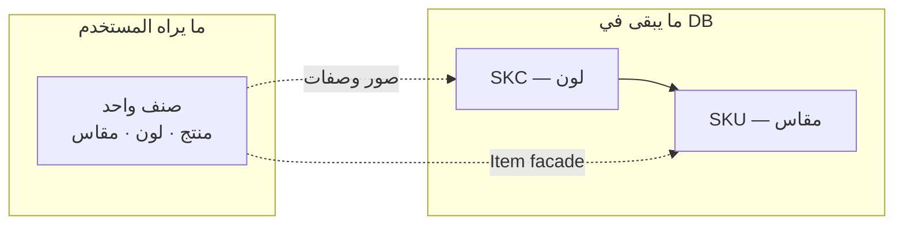

# خطة تحسين واجهات الأصناف — صنف واحد (لون + مقاس)

> **الحالة:** جاهزة للتنفيذ  
> **النطاق:** UI + Server Actions facade — بدون تغيير schema  
> **التاريخ:** 2026-07-10

---

## الهدف

المستخدم يرى ويدير **صنفاً واحداً** = **منتج + لون + مقاس** — بدون طبقتين (SKC ثم SKU) في الواجهة.

| قرار | التفاصيل |
|------|----------|
| نموذج UI | صنف = لون + مقاس كوحدة واحدة |
| مركز الإدارة | [`/items`](app/(dashboard)/items/page.tsx) |
| الربط بالمنتجات | [`/products`](app/(dashboard)/products/page.tsx) → `/items?productId={id}` |
| قاعدة البيانات | **بدون تغيير** — SKC + SKU يبقيان |
| مرفوض | مركز المنتج `/products/[id]`، دمج جداول DB |



---

## 1. قاموس المصطلحات

ملف [`lib/config/inventory-labels.ts`](lib/config/inventory-labels.ts):

| داخلي | واجهة المستخدم |
|-------|----------------|
| Product | **منتج** |
| SKC + SKU معاً | **صنف** |
| `sizeLabel` null | **قياس موحّد** |
| `skuCode` | **كود الصنف** |
| `itemNumber` | **رقم الصنف** (باركود داخلي) |

**قواعد:**
- لا SKC / SKU / SPU في العناوين، الأزرار، أو toast
- `skuCode` و `productNumber` فقط في حقول `font-mono`

---

## 2. نموذج الصنف

| المفهوم | UI | DB |
|---------|-----|-----|
| الصنف | صف جدول / صفحة تفاصيل | `SKU.id` |
| اللون | جزء من عنوان الصنف | `SKC.colorId` |
| المقاس | جزء من عنوان الصنف | `SKU.sizeLabel` |
| الصور | صفحة الصنف — **مشتركة لكل مقاسات اللون** | `ProductImage.skcId` |
| الصفات / رقم الصنف | حقول في النموذج | `SKC.attributes`, `SKC.itemNumber` |
| التسعير | per صنف | `ProductPrice.skuId` |

**التوفر:** toggle واحد على مستوى الصنف (`SKU.isAvailable`). إذا اللون غير متوفر (`SKC.isAvailable=false`) → الصنف يظهر «غير متوفر» مع رسالة «اللون غير متوفر» — بدون toggle ثانٍ.

**الحذف:** «حذف الصنف» = حذف SKU؛ إن كان آخر مقاس للون → حذف SKC وصوره تلقائياً.

---

## 3. طبقة Item Facade

ملف جديد [`lib/actions/item.ts`](lib/actions/item.ts) يغلّف [`skc.ts`](lib/actions/skc.ts) و [`sku.ts`](lib/actions/sku.ts):

### `createItem({ productId, colorId, sizeLabel?, itemNumber?, attributes? })`

1. إن وُجد SKC لـ `(productId, colorId)` → إنشاء SKU فقط (`addSKU`)
2. وإلا → إنشاء SKC + SKU (`addSKC`)
3. إرجاع `{ id: skuId }` — **معرّف الصنف في UI = skuId**

### `updateItem(skuId, data)`

Transaction موحّدة:
- مقاس، توفر → SKU
- لون، رقم صنف، صفات → SKC (مع unique `(productId, colorId)`)

### `deleteItem(skuId)`

- حذف SKU
- إن لا يتبقى SKU للـ SKC → حذف SKC + cascade للصور

### `toggleItemAvailability(skuId)`

- غلاف `toggleSkuAvailability`
- معطّل إذا `SKC.isAvailable === false`

### `getItemsPaginated` / `getItemDetail`

- تغليف `getSKUsPaginated` / `getSKUDetail`
- نوع موحّد في [`lib/types/item.ts`](lib/types/item.ts):

```typescript
type SerializedItem = {
  id: string                    // skuId
  skuCode: string
  productId: string
  productName: string
  productNumber: string
  colorId: string
  colorName: string
  colorCode: string
  hexCode: string
  sizeLabel: string | null
  itemNumber: string | null
  attributes: SkcAttributes | null
  isAvailable: boolean          // SKU && SKC
  colorUnavailable: boolean
  primaryImage: string | null
  priceCount: number
  productPrices: SerializedPrice[]
  images: ProductMediaImage[]
  siblingItems: Array<{
    id: string
    sizeLabel: string | null
    skuCode: string
    isAvailable: boolean
  }>
}
```

---

## 4. قائمة الأصناف — `/items`

### الصفحة [`app/(dashboard)/items/page.tsx`](app/(dashboard)/items/page.tsx)

- عنوان: **الأصناف**
- وصف: «كل صنف = منتج + لون + مقاس»
- زر: **إضافة صنف** → `ItemSheet`
- فلتر `?productId=` + banner: «عرض أصناف: {اسم المنتج}» + «عرض الكل»

### أعمدة جديدة [`components/items/item-columns.tsx`](components/items/item-columns.tsx)

| # | العمود | المحتوى |
|---|--------|---------|
| 1 | صورة | primary من اللون |
| 2 | **الصنف** | `{لون} · {مقاس\|قياس موحّد}` + `skuCode` |
| 3 | منتج | اسم + رقم → `/items?productId=` |
| 4 | رقم الصنف | `itemNumber` |
| 5 | أسعار | badge + sheet |
| 6 | توفر | toggle واحد |

### [`components/items/items-table.tsx`](components/items/items-table.tsx)

- بحث: «ابحث بالمنتج، اللون، المقاس، أو الكود...»
- استدعاء `getItemsPaginated`

---

## 5. نموذج موحّد

### [`components/items/item-form.tsx`](components/items/item-form.tsx)

1. المنتج — `ProductPicker`
2. اللون — `ColorPicker`
3. المقاس — `SizeLabelField` (اختياري)
4. رقم الصنف
5. الصفات — `SkcAttributesForm`
6. معاينة كود الصنف

**إنشاء:** `createItem` → `/items/{id}`  
**تعديل:** `updateItem` — تحذير عند تغيير اللون إن وُجدت مقاسات أخري

### [`components/items/item-sheet.tsx`](components/items/item-sheet.tsx)

- عنوان: «إضافة صنف»
- وصف: «منتج + لون + مقاس في خطوة واحدة»
- يستبدل `SkcSheet` للإنشاء

---

## 6. صفحة التفاصيل — `/items/[id]`

### [`components/items/item-details-client.tsx`](components/items/item-details-client.tsx)

يستبدل [`sku-details-client.tsx`](components/items/sku-details-client.tsx):

```
Breadcrumb: الأصناف › {منتج} › {لون · مقاس}

┌ Header ─────────────────────────────┐
│ صورة + عنوان الصنف + كود + رقم     │
│ [توفر] [تعديل] [حذف]               │
└─────────────────────────────────────┘
┌ التسعير ────────────────────────────┐
│ PriceListPanel                      │
└─────────────────────────────────────┘
┌ تفاصيل ─────────────────────────────┐
│ صفات · براند · تصنيف · وحدات       │
└─────────────────────────────────────┘
┌ الصور ──────────────────────────────┐
│ ImageGalleryUpload                  │
│ «الصور مشتركة لكل مقاسات هذا اللون»│
└─────────────────────────────────────┘
┌ مقاسات أخرى (collapsed) ────────────┐
│ روابط + إضافة مقاس سريع            │
└─────────────────────────────────────┘
```

**يُزال:** قسما SKC/SKU، toggle مزدوج، زرّا حذف، مصطلحات إنجليزية.

---

## 7. الربط مع المنتجات

| الملف | التغيير |
|-------|---------|
| [`components/products/columns.tsx`](components/products/columns.tsx) | «أصناف المنتج» → `/items?productId={id}` |
| [`components/inventory/product-form.tsx`](components/inventory/product-form.tsx) | بعد إنشاء → `/items?productId={id}` |
| [`app/(dashboard)/inventory/[id]/page.tsx`](app/(dashboard)/inventory/[id]/page.tsx) | redirect → `/items?productId={id}` |

**بدون** صفحة `/products/[id]`.

---

## 8. التنقل

[`lib/navigation.ts`](lib/navigation.ts): `/items` — **الأصناف** (بدون تغيير الاسم).

---

## 9. تنظيف

| ملف قديم | قرار |
|----------|------|
| `skc-sheet.tsx`, `skc-edit-sheet.tsx` | إهمال |
| `skc-form.tsx` | دمج في `item-form` |
| `sku-columns.tsx` | إهمال → `item-columns` |
| `sku-details-client.tsx` | إهمال → `item-details-client` |

[`lib/actions/inventory/_shared.ts`](lib/actions/inventory/_shared.ts): `revalidateItem(skuId, productId)`.

**خارج النطاق:** Bot API، orders، schema، Meilisearch logic.

---

## 10. مراحل التنفيذ

| # | المرحلة | الملفات |
|---|---------|---------|
| 1 | Labels + Types | `inventory-labels.ts`, `lib/types/item.ts` |
| 2 | Item Facade | `lib/actions/item.ts` |
| 3 | القائمة | `item-columns`, `items-table`, `items/page` |
| 4 | النموذج | `item-form`, `item-sheet` |
| 5 | التفاصيل | `item-details-client`, `[skuId]/page` |
| 6 | الربط + تنظيف | products columns, product-form, lint/build |

---

## 11. معايير القبول

- [ ] صنف واحد = لون + مقاس — بدون SKC/SKU في UI
- [ ] إنشاء بنموذج واحد
- [ ] تفاصيل: panel واحد، toggle واحد، حذف واحد
- [ ] `/items?productId=` مع banner
- [ ] `createItem` ذكي (SKC موجود → SKU فقط)
- [ ] صور مشتركة للون مع تنبيه
- [ ] `npm run lint` + `npm run build`
- [ ] الطلبات و Bot API بدون تغيير

---

## 12. Test plan

1. إنشاء صنف (منتج + لون + مقاس) → تفاصيل
2. صنف ثانٍ — نفس اللون، مقاس مختلف → SKC واحد
3. صنف — لون جديد → SKC + SKU
4. تعديل صفات/رقم → ينعكس على مقاسات اللون
5. حذف آخر مقاس → SKC يُحذف
6. توفر + لون غير متوفر
7. فلتر من `/products`
8. إنشاء طلب — لا regression
