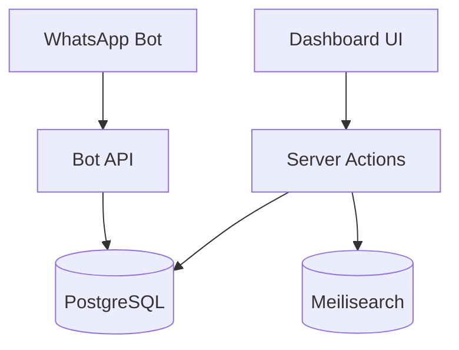

# Nawaat CRM — Project Map

خريطة معمارية للمطورين والوكلاء. للتثبيت: [README.md](README.md). للتعليمات: [AGENTS.md](AGENTS.md).

## Architecture

## Entry Points

| المسار | الغرض |
|--------|--------|
| `app/(dashboard)/` | لوحة التحكم (محمية بـ middleware JWT) |
| `app/login/` | تسجيل الدخول |
| `app/api/v1/bot/` | Bot API (`x-api-key`) |
| `app/api/v1/dashboard/` | Dashboard API (JWT cookie) — Meilisearch ops |
| `app/api/v1/bot/orders/` | Orders API للبوت (`x-api-key`) — مصدر واحد |
| `public/openapi.json` | عقد Bot API المنشور (يدوي، يطابق الكود) |
| `app/invoice/[id]/` | فاتورة عامة (بدون auth) |
| `lib/actions/` | منطق أعمال لوحة التحكم (Server Actions) |
| `lib/orders/` · `lib/customers/` · `lib/bot/` | منطق Bot API |

## Auth Model

**لا نظام أدوار** — أي مستخدم مسجّل = صلاحيات كاملة.

| الطبقة | الآلية |
|--------|--------|
| Dashboard pages | `middleware.ts` → JWT cookie |
| Server Actions | `requireAuth()` |
| Dashboard API | `requireDashboardAuth()` |
| Bot API | `validateApiKey()` |

**استثناءات عامة:** `getStoreSettings()`, `getOrderById()`, `getDefaultCurrency()` (فاتورة + login).

## Risky Areas

### التسعير
- `ProductPrice`: unique على `(productId, priceLabelId, currencyId, unitId)`
- `Customer.priceLabelId` يحدد تسعيرة البوت
- راجع skill `nawaat-pricing`

### الطلبات
- **Snapshot إلزامي** في `OrderItem` عند الإنشاء
- `resolveItemPrice()` للعرض — لا تعدّل snapshot لاحقاً
- راجع skill `nawaat-orders`

### Meilisearch
- resilient — لا تعطّل التطبيق
- راجع skill `nawaat-meilisearch`

## Module Ownership

| المجال | الملفات الرئيسية |
|--------|------------------|
| Inventory | `lib/actions/inventory/`, `lib/config/product-code.config.ts` |
| Pricing | `lib/actions/inventory/price.actions.ts`, `lib/actions/price-labels.ts` |
| Orders | `lib/orders/service.ts`, `lib/actions/orders.ts`, `lib/order-utils.ts` |
| Customers | `lib/actions/customers.ts` (dashboard) · `lib/customers/` (Bot API) |
| Bot API | skill `nawaat-bot-api` · rule `bot-api.mdc` · `public/openapi.json` |
| Search | Meili: `lib/meilisearch.ts` + `searchProductIdsInMeilisearch` · Bot: `lib/bot/product-search.ts` (Meili + Prisma hydrate / fallback) |

## Schema

مصدر الحقيقة: `prisma/schema.prisma`

بعد التغيير: `npm run db:migrate` + `npm run db:generate` + حدّث `lib/prisma-includes.ts` و `lib/types/`.
